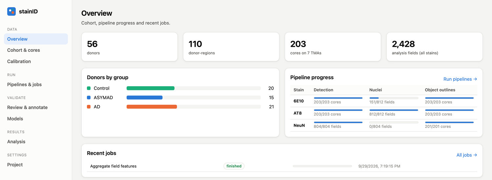
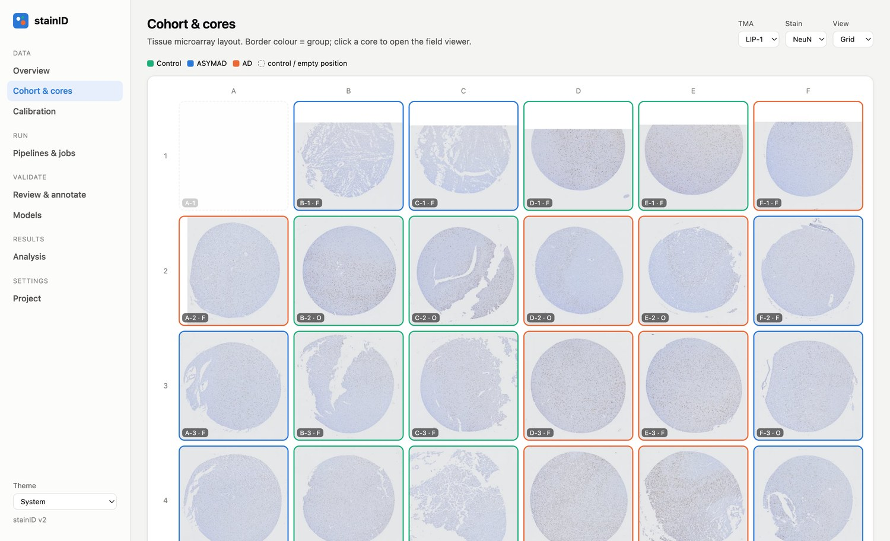
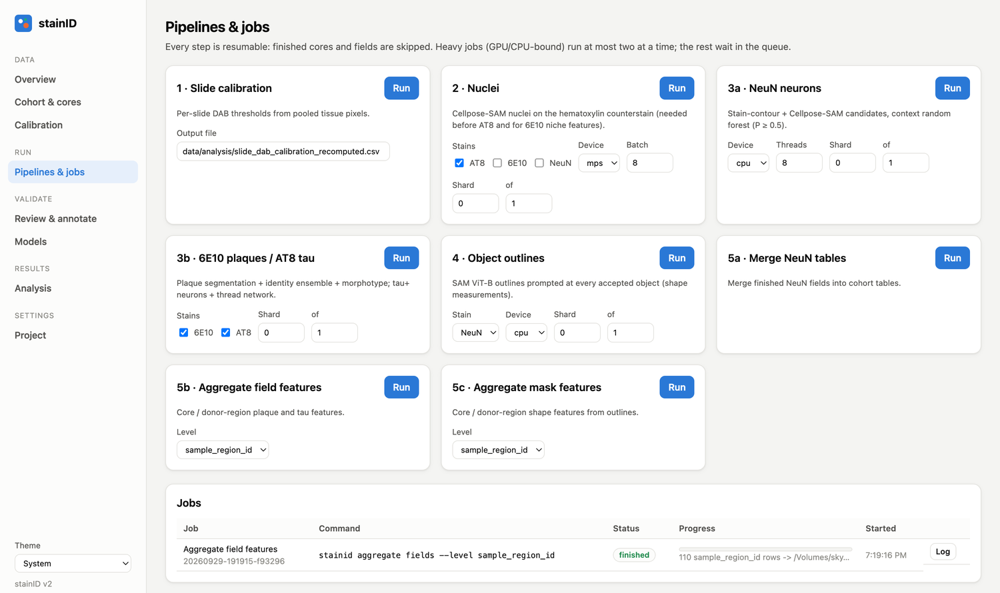
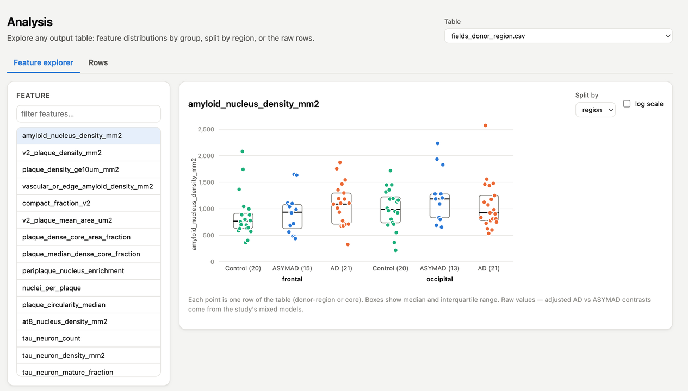
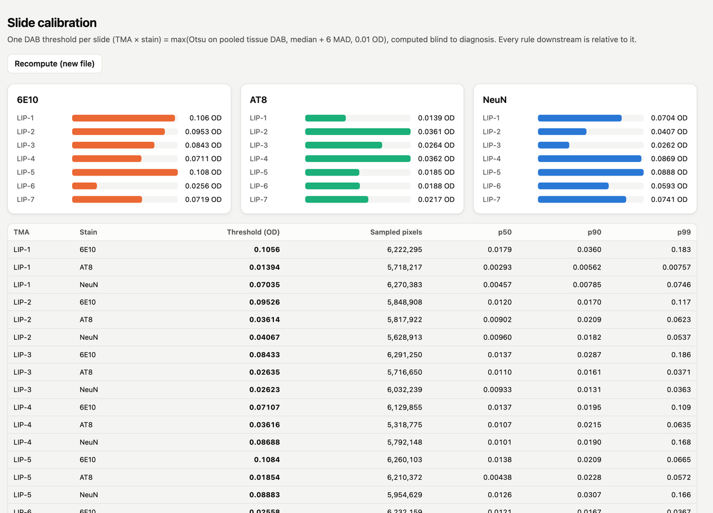

# stainID

Stain-level morphology for brain tissue microarrays (TMAs). stainID takes scanned
immunohistochemistry slides, cuts out every core, and measures object-level pathology on
calibrated, artifact-masked native-resolution fields:

| Stain | What is measured |
|---|---|
| **NeuN** | NeuN-positive neuronal profiles: density, positive fraction, soma size and shape |
| **6E10** | Amyloid plaques: burden, density, compact / diffuse morphotype, dense cores, vascular/edge amyloid, peri-plaque nuclei |
| **AT8** | Tau pathology: positive area, tau+ neurons (nucleus-ring and dense-body), neuropil thread network |

Everything runs from one command-line tool (`stainid`) or from a local web app that
browses the cohort, launches and monitors pipeline jobs, inspects detections on the tissue, and
collects blinded reference labels.


## Install

Python ≥ 3.10.

```bash
git clone <this repo> stainID && cd stainID
python -m venv .venv && source .venv/bin/activate
pip install -e ".[app,deep,slides]"
```

Extras: `slides` reads Olympus `.vsi` scans (aicsimageio / Bio-Formats; needs a Java runtime), `deep` adds PyTorch,
Cellpose-SAM, Segment Anything and Hugging Face transformers, `app` adds the web server,
`dev` adds pytest and ruff. The core package (numpy / scikit-image / scikit-learn / OpenCV)
installs without any of them.

The web app ships prebuilt inside the package once built. To build it from source you need
Node ≥ 20:

```bash
cd webapp && npm ci && npm run build   # writes src/stainid/api/static/
```

## Quick start

```bash
stainid init --project path/to/study        # writes path/to/study/stainid.yaml
stainid --project path/to/study info        # shows every resolved input, model and output path
stainid --project path/to/study serve       # web app at http://127.0.0.1:8765
```

A project is any folder with a `stainid.yaml`; all paths in it are relative to that folder. See
[docs/project.md](docs/project.md) for the configuration, required input tables and models.

## Pipeline

```
slides ──dearray──▶ core manifest ──export──▶ native core PNGs ──core QC──▶ select fields
                                                                                │
             ┌──────────────── calibrate (one DAB threshold per slide) ◀────────┘
             ▼
   nuclei (Cellpose-SAM) ──▶ neun │ fields (6E10, AT8) ──▶ masks (SAM outlines) ──▶ aggregate
```

| Step | Command |
|---|---|
| Find cores on each slide (affine lattice fit) | `stainid-dearray <slides_dir>` |
| Attach the TMA map (donor, region, group) | `stainid-attach-layout` |
| Export native-resolution cores | `stainid-export-cores` |
| Core tissue / focus QC and contact sheets | `stainid-core-qc`, `stainid-core-sheets` |
| Select analysis fields | `stainid select` |
| Per-slide DAB threshold | `stainid calibrate` |
| Nuclei on the hematoxylin counterstain | `stainid nuclei --stain AT8 --stain 6E10` |
| NeuN neurons | `stainid neun`, then `stainid neun --merge` |
| 6E10 plaques and AT8 tau | `stainid fields` |
| Object outlines | `stainid masks --stain NeuN` (and `6E10`, `AT8`) |
| Core / donor-region tables | `stainid aggregate fields`, `stainid aggregate masks` |

Every step is resumable (finished cores and fields are skipped) and heavy steps take
`--shard-index/--shard-count` so they can be spread over processes or machines. Method details
and parameters for each stain are in [docs/pipelines.md](docs/pipelines.md).

## Web app

| | |
|---|---|
|  |  |
| **Overview**: cohort size and per-stain pipeline progress | **Cohort & cores**: TMA layout by group; click a core to open it |
|  |  |
| **Pipelines & jobs**: run any step, at most two heavy jobs at once, live logs | **Review & annotate**: blinded, keyboard-driven reference labelling |
|  |  |
| **Analysis**: any output feature by group and region | **Calibration**: per-slide DAB thresholds |

The field viewer overlays detections, SAM outlines, above-threshold DAB, excluded
regions and traced tau threads on the native image, with light and dark themes. See
[docs/webapp.md](docs/webapp.md).

## Repository layout

```
src/stainid/
  project.py        stainid.yaml loading and path resolution
  cli.py            the `stainid` command
  workflows/        end-to-end steps used by the CLI and the job runner
  slides/           .vsi reading, dearraying, core export, TMA layout
  qc/               core QC, focus, artifact exclusions
  sampling/         field selection and review sampling frames
  imaging/          colour deconvolution, tissue / fold / artifact masks, calibration
  nuclei.py         Cellpose-SAM nuclei
  stains/           neun/, amyloid/, tau/ stain-specific detection and classifiers
  masks/            Segment Anything outlines and shape features
  analysis/         core / donor-region aggregation
  registration/     cross-stain core registration
  review/           blinded review sets (sampling, storage)
  api/              FastAPI backend for the web app
webapp/             React + TypeScript front end (Vite)
tools/qupath/       QuPath scripts for TMA grids and core export
tests/              pytest suite (synthetic data only)
```

Study data, models, results and analysis scripts live in `data/` and `workspace/` next to the
code and are not part of the repository.

## Development

```bash
pip install -e ".[dev,app,slides]"
pytest
ruff check src tests
cd webapp && npm run dev      # hot-reloading UI, proxies /api to `stainid serve`
```

See [docs/development.md](docs/development.md).
