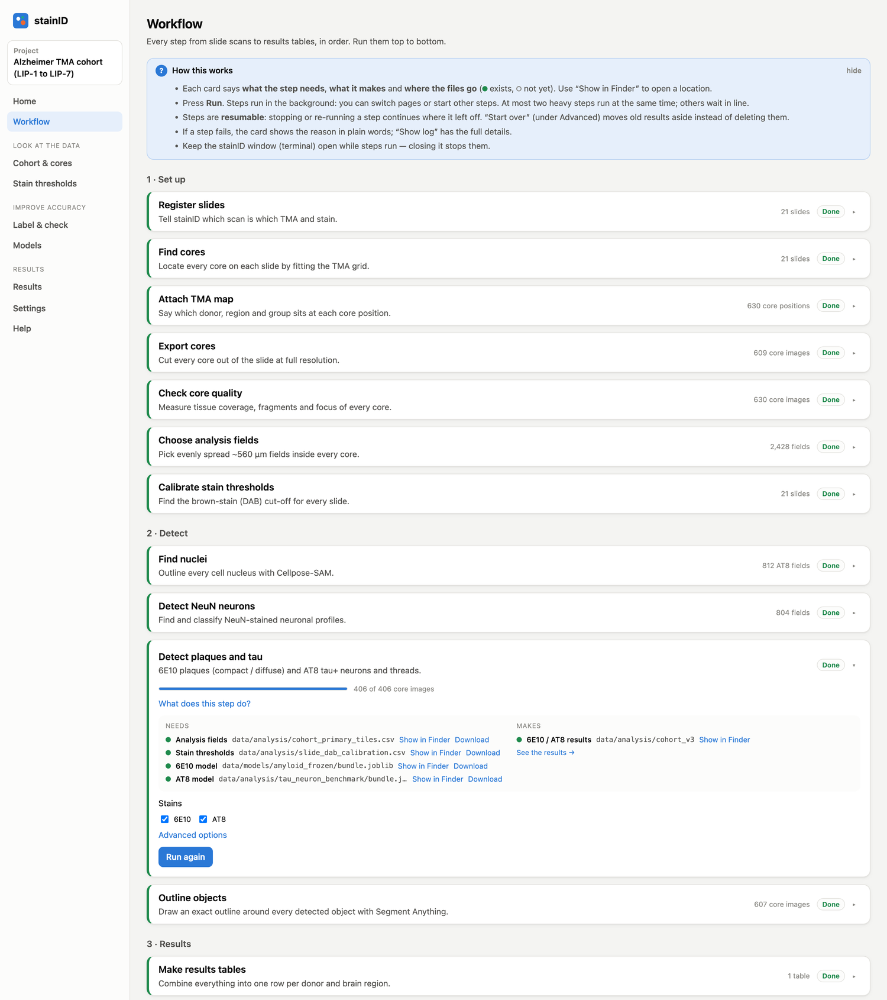
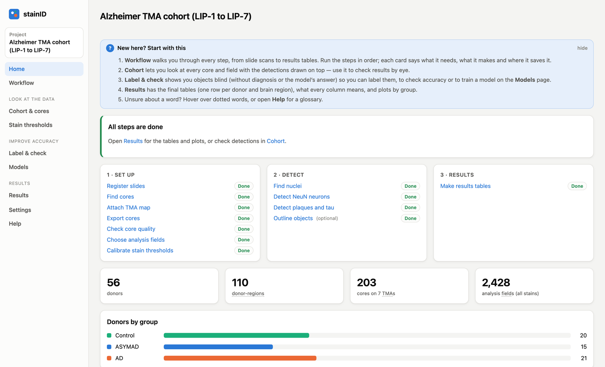
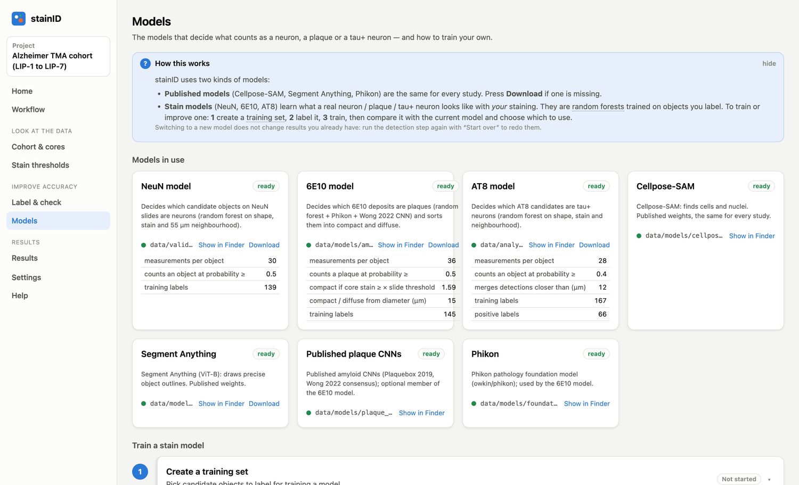
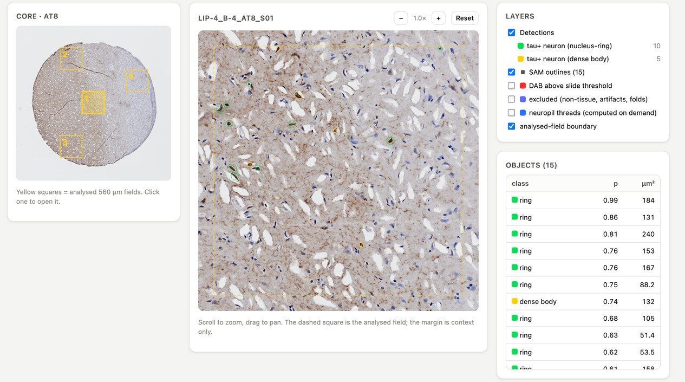
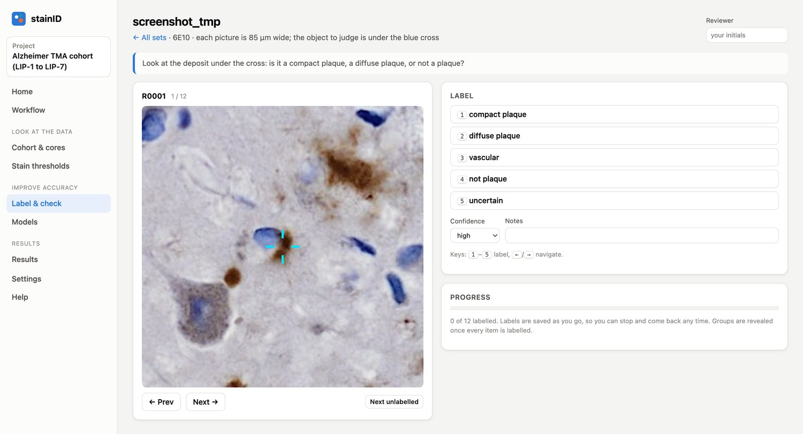
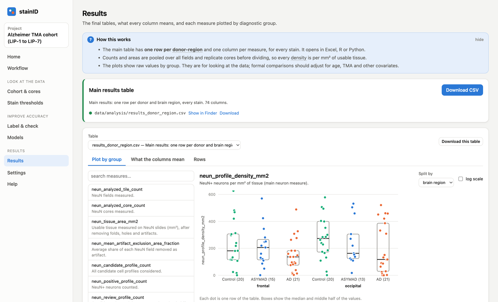
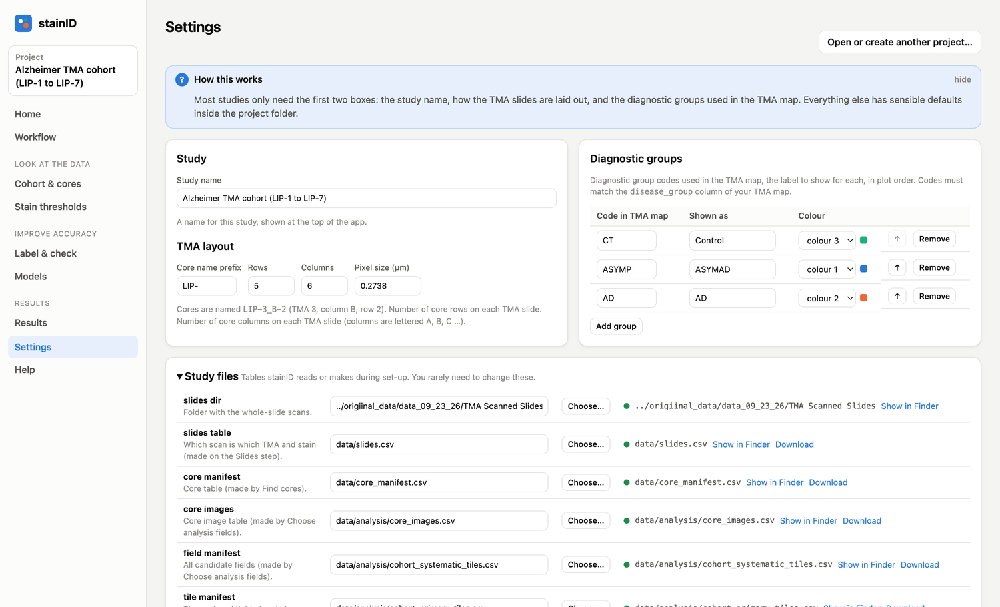

# stainID

Stain-level morphology for brain tissue microarrays (TMAs). stainID takes scanned
immunohistochemistry slides, cuts out every core, and measures object-level pathology on
calibrated, artifact-masked native-resolution fields:

| Stain | What is measured |
|---|---|
| **NeuN** | NeuN-positive neurons: density, positive fraction, soma size and shape |
| **6E10** | Amyloid plaques: burden, density, compact / diffuse morphotype, dense cores, vascular/edge amyloid, peri-plaque nuclei |
| **AT8** | Tau pathology: positive area, tau+ neurons (tangles and pretangles), neuropil thread network |

The whole study runs from a local web app: it goes from slide scans to one results row per donor and brain region.
Along the way you can check detections on the tissue, label objects blind and train the stain models on your own
slides. Every step is also a `stainid` command.



## What you need

| | Where it comes from |
|---|---|
| **Slide scans**, one per TMA and stain (`.vsi`, `.svs`, `.ndpi`, `.czi`, `.tif`, …) | your scanner |
| **TMA map**: which donor, brain region and diagnostic group sits at each core position | a CSV you fill in; the app gives a template with every core position listed |
| **Stain models** (NeuN, 6E10, AT8) | trained in the app on objects you label, or copied from an earlier study with the same staining |
| **Published models** (Cellpose-SAM, Segment Anything, Phikon) | downloaded by the app (Models page) |
| Published plaque CNN weights (Wong et al. 2022; Tang et al. 2019), optional, used by the 6E10 model | copied by hand into `data/models/plaque_cnn` (they have no download link) |
| Python 3.10+, and Java for `.vsi` scans | [python.org](https://www.python.org/downloads/), [adoptium.net](https://adoptium.net) |

## Getting started

1. **Install once.** Download this repository (green *Code* button → *Download ZIP*), unzip it, and double-click
   **`Install stainID.command`** (macOS) or **`Install stainID.bat`** (Windows).
   On macOS the first time, right-click the file → *Open* to allow it.
2. **Start.** Double-click **`Start stainID.command`** (or `.bat`). stainID opens in your web browser. Keep the small
   terminal window open while you work, because closing it stops running steps.
3. **Create a project** on the welcome screen: a study name and an empty folder. Settings, core images and results
   for the study are all kept in that folder.
4. **Describe your TMAs** on the Settings page: rows and columns of cores per slide, the core-name prefix and the
   diagnostic groups.
5. **Run the Workflow page from top to bottom.** Each step says what it needs, what it makes and where the files go.
   Anything missing has a button next to it: go to the step that makes it, download it, or get a template.
   *Run all remaining steps* queues everything in the right order.
6. **Check and use the results.** Look at detections on the tissue (Cohort & cores), label a check set to measure
   accuracy on your slides (Label & check), and download the results table (Results).

The Help page in the app has the same guide, answers to common questions and a glossary.

## The workflow

| | Step | What it does | Command |
|---|---|---|---|
| **Slides** | Register slides | say which scan is which TMA and stain (guessed from file names) | *web app* |
| | Find cores | fit the TMA grid on each slide | `stainid dearray` |
| | Attach TMA map | donor, brain region and diagnostic group for each core | `stainid layout` |
| | Export cores | native-resolution core images | `stainid export` |
| | Check core quality | tissue coverage, fragments, focus | `stainid qc` |
| **Fields** | Choose analysis fields | evenly spread ~560 µm fields per core | `stainid select` |
| | Calibrate stain thresholds | one DAB threshold per slide, blind to diagnosis | `stainid calibrate` |
| **Detection** | Find nuclei | Cellpose-SAM nuclei (needed for AT8) | `stainid nuclei --stain AT8` |
| | Detect NeuN neurons | candidates + NeuN model | `stainid neun` |
| | Detect plaques and tau | 6E10 plaques and morphotypes; AT8 tau+ neurons and threads | `stainid fields` |
| | Outline objects | Segment Anything outlines and shape features (optional) | `stainid masks` |
| **Results** | Make results tables | one row per donor and region, every stain | `stainid summarize` |
| **Models** | Download public models | Cellpose-SAM, Segment Anything, Phikon | `stainid download-models` |
| | Create a training set, Train a model | label objects, train and compare a stain model | `stainid training-set`, `stainid train` |

Steps run in the background, in dependency order, at most two heavy ones at a time; all of them can be stopped and
resumed. [docs/webapp.md](docs/webapp.md) explains how the queue works, and [docs/pipelines.md](docs/pipelines.md)
says what each step computes.

## The app

| | |
|---|---|
|  |  |
| **Home**: your next step and overall progress | **Models**: download published models; create a training set, label it, train, compare, switch |
|  |  |
| **Cohort & cores**: every core and field with detections, outlines and masks drawn on the tissue | **Label & check**: blind, keyboard-driven labelling |
|  |  |
| **Results**: download the main table, what every column means, plots by group | **Settings**: study layout, diagnostic groups and every file location |

## Command line

```bash
git clone https://github.com/skysky2333/stainID.git && cd stainID
python -m venv .venv && source .venv/bin/activate
pip install -e ".[app,deep,slides]"
stainid serve                              # the web app
stainid --project path/to/study status     # progress of every step
stainid --project path/to/study neun       # run one step
```

Install extras: `slides` reads scanner files (Bio-Formats, needs Java); `deep` adds PyTorch, Cellpose-SAM, Segment
Anything and transformers; `app` is the web server; `dev` adds pytest and ruff. Heavy steps can be split across
machines with `--shard-index/--shard-count`. The web app is committed prebuilt, so Node is only needed to change the
front end.

## Documentation

Read in this order:

1. [Using the app](docs/webapp.md): every page, how steps are queued, labelling and training models.
2. [Project files](docs/project.md): the project settings (`stainid.yaml`), the input tables and every output file.
3. [Methods](docs/pipelines.md): what each step computes, with its parameters, and the models.
4. [Development](docs/development.md): tests, front end, the API and adding a step.

## Repository layout

```
src/stainid/
  project.py        stainid.yaml loading, saving and path resolution
  cli.py            the `stainid` command
  workflows/        every step (steps.py is the registry the CLI, job runner and web app share)
  training/         training sets and model training from blind labels
  slides/           slides table, scan reading, dearraying, core export, TMA map
  qc/               core QC, focus, artifact exclusions
  sampling/         field selection
  imaging/          colour deconvolution, tissue / fold / artifact masks, calibration
  nuclei.py         Cellpose-SAM nuclei
  stains/           neun/, amyloid/, tau/ stain-specific detection and classifiers
  masks/            Segment Anything outlines and shape features
  analysis/         core / donor-region aggregation and the column dictionary
  registration/     cross-stain core registration
  review/           blind review sets
  api/              FastAPI backend (and the built web app in api/static)
webapp/             React + TypeScript front end
tools/qupath/       QuPath scripts for TMA grids and core export
tests/              pytest suite (synthetic data only)
```

## Acknowledgements

`stainid/stains/amyloid/wong_consensus.py` is copied from the consensus-learning code of
Wong et al. (Keiser lab, [keiserlab/consensus-learning-paper](https://github.com/keiserlab/consensus-learning-paper)).
stainID uses the following published models; their weights are not redistributed here:

- Wong DR, Tang Z, Mew NC, et al. Deep learning from multiple experts improves identification of amyloid neuropathologies. *Acta Neuropathol Commun* 10, 66 (2022).
- Tang Z, Chuang KV, DeCarli C, et al. Interpretable classification of Alzheimer's disease pathologies with a convolutional neural network pipeline. *Nat Commun* 10, 2173 (2019).
- Pachitariu M, Rariden M, Stringer C. Cellpose-SAM: superhuman generalization for cellular segmentation. *bioRxiv* (2025).
- Kirillov A, Mintun E, Ravi N, et al. Segment Anything. *ICCV* (2023).
- Filiot A, Ghermi R, Olivier A, et al. Scaling self-supervised learning for histopathology with masked image modeling (Phikon). *medRxiv* (2023).

## License

BSD 2-Clause, see [LICENSE](LICENSE). Vendored third-party code keeps its original attribution.
